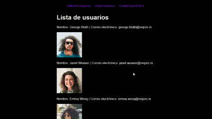

# Ejercicios de práctica
## Importante
Todas las entregas deben realizarse en el foro de tarea correspondiente en el campus de inove, salvo especificarse lo contrario.

## Preparar nuestro entorno de trabajo
Para poder realizar este ejercicio deberá crear un proyecto nuevo, o aprovechar otro que haya utilizado para otro desafio.

Deberá instalar las librerías/paquetes:
- axios
- react-router-dom

## Consigna
Utilizar la API ReqRes para realizar una solicitud GET con Axios y renderizar los datos recibidos utilizando el método map(). Luego, crear un componente para realizar una solicitud POST y mostrar un mensaje indicando si la solicitud fue exitosa o no. Por último, crea un componente que tome los datos del usuario a crear desde un formulario.

Las peticiones se harán a ```https://reqres.in/api/users```

__NOTA__: Este ejercicio de clase no sugiere utilizar una carpeta "api" para organizar allí sus requests dado que es un ejemplo pequeño y puntual. De todas maneras, si usted prefiere puede organizar las peticiones a la API en otra carpeta. 

Paso a paso:

1. Configuración del proyecto:

Asegúrate de tener Axios instalado en tu proyecto de React.

2. Creación del componente para la solicitud GET:

Crea un nuevo componente llamado "GetUsers.jsx" dentro de la carpeta "components".
Importa Axios en el componente.
Define una función de componente llamada "GetUsers".
Dentro de la función del componente, utiliza el hook useState para inicializar un estado para almacenar los datos de los usuarios.
Utiliza el hook useEffect para realizar la solicitud GET una vez que el componente se haya montado.
En la función useEffect, utiliza Axios para hacer la solicitud GET a la ruta "https://reqres.in/api/users".
En el callback de la solicitud GET, actualiza el estado de los usuarios con los datos recibidos.
En el return del componente, renderiza los datos de los usuarios utilizando el método map().
Por ejemplo, puedes renderizar el nombre y el correo electrónico de cada usuario en un elemento `<p>`
y el avatar del usuario en una etiqueta ``. Con un operador ternario muestra un `  <h3>Loading...</h3>` para que el usuario sepa que se estan cargando los datos.

3. Creación del componente para la solicitud POST:

Crea un nuevo componente llamado "CreateUser.jsx" dentro de la carpeta "components".
Importa Axios en el componente.
Define una función de componente llamada "CreateUser".
Dentro de la función del componente, utiliza el hook useState para inicializar un estado para almacenar el mensaje de éxito o fracaso de la petición, useState("").
Crea una función handleCreateUser que se ejecutará al enviar el objeto newUser en una petición post. La petición se dispara con un boton llamado "Create User" y un evento `onClick={handleCreateUser}`
Dentro de handleCreateUser, utiliza Axios para hacer la solicitud POST a la ruta "https://reqres.in/api/users" con los datos del usuario. El objeto a enviar podría ser el siguiente:

```js
const newUser = {
  name: "Juan Carlos",
  job: "Developer",
};
```

En el callback de la solicitud POST, actualiza el estado del mensaje según el resultado de la solicitud.

4. Creación del componente CreateUserForm:

Crea un nuevo componente llamado "CreateUserForm.jsx" dentro de la carpeta "components".
Importa useState y Axios en el componente.
Define una función de componente llamada "CreateUserForm".
Dentro de la función del componente, utiliza el hook useState para inicializar un estado para almacenar el mensaje de éxito o fracaso, useState("").
Crea una función handleSubmit que se ejecutará al enviar el formulario de creación de usuario.

Dentro de handleSubmit, utiliza Axios para hacer la solicitud POST a la ruta "https://reqres.in/api/users" con los datos del usuario.
En el callback de la solicitud POST, actualiza el estado del mensaje según el resultado de la solicitud. La peticion se hará en un handleSubmit, es decir,`  <form onSubmit={handleSubmit}>`.

A handleSubmit se le tendrá que pasar los datos ingresados en el formulario por el usuario de alguna manera.
En el return del componente, renderiza un formulario de creación de usuario que capture los datos necesarios y muestre el mensaje de éxito o fracaso según el estado.
En el form, arma una etiqueta label y otra input, por cada campo que necesites.

```html
<label>
  Name:
  <input type="text" name="name" />
</label>
<br />
```

Arma un botón para resetear los input del formulario y llama a una funcion que resetee los datos estados existentes.

```html
<input type="reset" value="Reset" onClick="{handleReset}" />
```

El usuario tampoco puede ejecutar la petición sino relleno todos los campos en el formulario. Agregué la siguiente validación para asegurarse de eso.

```js
if (!user.name || !user.job) {
  setMessage("Please fill in all the fields.");
  return;
}
```

4. Configuración de las rutas y componentes en App.js:

En App.js, importa los componentes GetUsers, CreateUserForm y CreateUser, así como las dependencias de react-router-dom necesarias.
Añade las rutas correspondientes para mostrar cada componente utilizando el enrutador react-router-dom.

5. Aplique estos estilos globales en el proyecto.

```css
body {
  font-family: Arial, sans-serif;
  display: flex;
  justify-content: center;
  background-color: black;
  color: white;
}

nav ul {
  display: flex;
  justify-content: flex-start;
  list-style: none;
}

li {
  margin: 10px;
}
a {
  text-decoration: none;
  height: 20%;
  color: blueviolet;
}
a:active {
  color: yellowgreen;
}

.container {
  background-color: blue;
  padding: 20px;
}

label,
input {
  display: inline-block;
  margin: 5px;
}
```

Al finalizar los pasos anteriores, deberías tener una aplicación funcional que realice una solicitud GET para mostrar los usuarios y una solicitud POST para crear un nuevo usuario, con mensajes de éxito o fracaso según corresponda.

## Resultado final


